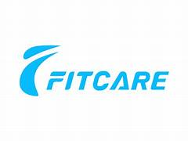
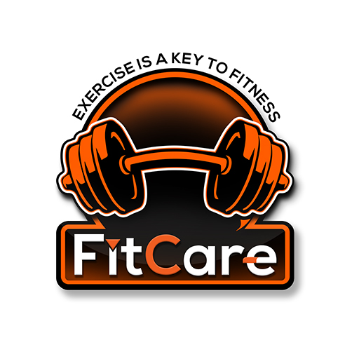

<p align="center">
  
</p>

<h1 align="center">🏋️ FITCARE — AI-Powered Fitness & Wellness Platform</h1>

<p align="center">
  <strong>Personalized fitness guidance through intelligent diet planning, mood-based workout music, personality quizzes, and weekly challenges — all in one beautifully designed platform.</strong>
</p>

<p align="center">
  
  
  
  
  
</p>

---

## 📋 Table of Contents

- [Overview](#-overview)
- [Key Features](#-key-features)
- [Architecture](#-architecture)
- [Tech Stack](#-tech-stack)
- [Project Structure](#-project-structure)
- [Getting Started](#-getting-started)
- [API Endpoints](#-api-endpoints)
- [Screenshots](#-screenshots)
- [Contributing](#-contributing)
- [License](#-license)

---

## 🌟 Overview

**FitCare** is a full-stack, AI-driven fitness and wellness platform designed to provide users with a comprehensive health companion. The platform combines intelligent diet recommendation algorithms, mood-adaptive workout music playlists, personality-based fitness quizzes, and gamified weekly challenges — all wrapped in a modern, responsive UI with dark/light theme support and smooth page transitions.

Built with **React 19** on the frontend and **Express 5 + MongoDB** on the backend, FitCare delivers a seamless, interactive experience that adapts to each user's goals, preferences, and lifestyle.

---

## ✨ Key Features

### 🥗 AI Diet Recommendation Engine
- Generates **personalized meal plans** based on age, gender, fitness goals, dietary preferences, and allergies
- Supports multiple diet types: **Keto, Vegan, Vegetarian, Indian, Mediterranean**
- Provides age-adaptive and gender-specific nutritional guidance
- Includes hydration tips, meal pacing strategies, and lifestyle advice
- All recommendations are persisted to MongoDB for tracking

### 🎵 Mood-Based Workout Music
- Curated music library with **50+ tracks** across three mood categories: **Energetic**, **Calm**, and **Cardio**
- Links directly to **Spotify** and **YouTube** for instant playback
- Randomized playlist generation (3 tracks per session) for variety
- Tracks mood history and playlist preferences in the database

### 🧠 Fitness Personality Quiz
- Interactive quiz that determines your **fitness personality type**
- **40+ unique personality archetypes** (e.g., HIIT Hero, Zen Champion, AI Athlete, Cold Recovery Ninja)
- Saves quiz history with username, answers, and results
- Fun, gamified experience with detailed personality descriptions

### 🏆 Weekly Fitness Challenges
- **10 structured challenge categories** including Sleep Optimization, HIIT, Strength Building, Clean Eating, Sprint Protocol, and more
- Personalized challenge assignment based on user's name, goal, and fitness level
- Each challenge includes actionable daily steps and tracking tips
- Challenge history persisted for progress tracking

### 📝 Community Blog Platform
- Dynamic blog system with rich content cards
- Create and share fitness tips, transformation stories, and wellness articles
- Beautiful image-rich blog layout with responsive grid design

### 📊 Smart Fitness Tools
- **BMI Calculator** — Instant body mass index calculation with health category feedback
- **Step Counter & Calorie Tracker** — Track daily steps and estimate calories burned
- **TDEE Calculator** integration for comprehensive metabolic insights

### 📬 Contact & Email System
- Contact form with **automated email confirmation** via Nodemailer
- Professional HTML email templates with FitCare branding
- All inquiries saved to MongoDB for follow-up

### 🎨 Modern UI/UX
- **Dark/Light theme toggle** with smooth transitions
- **Framer Motion** page animations with `AnimatePresence`
- **Swiper.js** powered image carousels and galleries
- Fully responsive design with **Bootstrap 5** grid system
- Custom CSS with CSS variables for consistent theming

---

## 🏗 Architecture

```
┌─────────────────────────────────────────────────────────┐
│                    FITCARE PLATFORM                     │
├──────────────────────┬──────────────────────────────────┤
│                      │                                  │
│   ┌──────────────┐   │   ┌────────────────────────┐     │
│   │  React 19    │   │   │   Express 5 Server     │     │
│   │  Frontend    │◄──┼──►│   REST API             │     │
│   │  Port: 3000  │   │   │   Port: 5000           │     │
│   └──────┬───────┘   │   └──────────┬─────────────┘     │
│          │           │              │                   │
│   ┌──────┴───────┐   │   ┌──────────┴─────────────┐     │
│   │  Components  │   │   │   Route Handlers       │     │
│   │  ├─ Navbar   │   │   │   ├─ /api/diet         │     │
│   │  ├─ DietForm │   │   │   ├─ /api/music        │     │
│   │  ├─ QuizForm │   │   │   ├─ /api/quiz         │     │
│   │  ├─ Playlist │   │   │   ├─ /api/challenge    │     │
│   │  ├─ BMI      │   │   │   ├─ /api/contact      │     │
│   │  └─ Blog     │   │   │   └─ /api/blog         │     │
│   └──────────────┘   │   └──────────┬─────────────┘     │
│                      │              │                   │
│   ┌──────────────┐   │   ┌──────────┴─────────────┐     │
│   │  Pages       │   │   │   MongoDB (Mongoose)   │     │
│   │  ├─ Home     │   │   │   ├─ Diet Collection   │     │
│   │  ├─ DietAI   │   │   │   ├─ Music Collection  │     │
│   │  ├─ MusicAI  │   │   │   ├─ Quiz Collection   │     │
│   │  ├─ QuizAI   │   │   │   ├─ Challenge Coll.   │     │
│   │  ├─ Blog     │   │   │   ├─ Contact Coll.     │     │
│   │  ├─ About    │   │   │   └─ Blog Collection   │     │
│   │  └─ Contact  │   │   └────────────────────────┘     │
│   └──────────────┘   │                                  │
│                      │   ┌────────────────────────┐     │
│                      │   │   Nodemailer Service   │     │
│                      │   │   Gmail SMTP           │     │
│                      │   └────────────────────────┘     │
│                      │                                  │
└──────────────────────┴──────────────────────────────────┘
```

---

## 🛠 Tech Stack

| Layer | Technology | Purpose |
|-------|-----------|---------|
| **Frontend** | React 19.1 | Component-based UI framework |
| **Routing** | React Router DOM 7 | Client-side SPA navigation |
| **Animations** | Framer Motion 12 | Page transitions & micro-interactions |
| **Carousel** | Swiper.js 11 | Image galleries & content sliders |
| **Styling** | Bootstrap 5.3 + Custom CSS | Responsive grid & design system |
| **Icons** | React Icons 5 | Scalable vector icon library |
| **Notifications** | React Toastify 11 | User feedback toast messages |
| **HTTP Client** | Axios 1.10 | API communication layer |
| **Backend** | Express 5 (Node.js) | RESTful API server |
| **Database** | MongoDB + Mongoose 8.16 | Document-based data persistence |
| **Email** | Nodemailer 7 | Automated email confirmations |
| **CORS** | cors middleware | Cross-origin request handling |

---

## 📁 Project Structure

```
FITCARE/
│
├── fitcare-client/                 # React Frontend Application
│   ├── public/
│   │   ├── index.html              # HTML entry point
│   │   ├── favicon.ico             # App favicon
│   │   └── manifest.json           # PWA manifest
│   │
│   └── src/
│       ├── App.js                  # Root component with routing
│       ├── index.js                # React DOM entry
│       │
│       ├── components/             # Reusable UI Components
│       │   ├── Navbar.jsx          # Navigation bar with responsive menu
│       │   ├── Footer.jsx          # Site footer
│       │   ├── DietForm.jsx        # AI diet recommendation form
│       │   ├── BMIForm.jsx         # BMI calculator widget
│       │   ├── StepCounter.jsx     # Step & calorie tracker
│       │   ├── QuizForm.jsx        # Fitness personality quiz
│       │   ├── PlaylistGenerator   # Music playlist UI
│       │   ├── ChallengeList.jsx   # Challenge cards display
│       │   ├── NewBlogForm.jsx     # Blog creation form
│       │   ├── HeroSection.jsx     # Landing page hero
│       │   ├── PageWrapper.jsx     # Framer Motion page wrapper
│       │   └── ThemeToggle.jsx     # Dark/Light mode switch
│       │
│       ├── pages/                  # Page-Level Components
│       │   ├── Home.jsx            # Landing page with all sections
│       │   ├── DietAI.jsx          # AI diet planning page
│       │   ├── MusicAI.jsx         # Mood-based music page
│       │   ├── QuizAI.jsx          # Fitness quiz page
│       │   ├── ChallengeAI.jsx     # Weekly challenges page
│       │   ├── Blog.jsx            # Community blog page
│       │   ├── About.jsx           # About FitCare page
│       │   ├── Contact.jsx         # Contact form page
│       │   └── NotFound.jsx        # 404 error page
│       │
│       ├── styles/                 # Global Stylesheets
│       │   ├── global.css          # Base styles & theme definitions
│       │   └── variables.css       # CSS custom properties
│       │
│       └── assets/images/          # Visual Assets (50+ images)
│           ├── fitcare-logo.png    # Brand logo
│           ├── hero-banner.jpg     # Homepage hero image
│           ├── diet-*.jpg/png      # Diet section imagery
│           ├── music-*.jpg/png     # Music section imagery
│           ├── quiz-*.jpg/png      # Quiz section imagery
│           ├── blog*.jpg           # Blog post images
│           ├── gallery*.jpg        # Gallery carousel images
│           └── ...                 # Additional visual assets
│
├── fitcare-server/                 # Express Backend Server
│   ├── server.js                   # Server entry point & route mounting
│   │
│   ├── config/
│   │   └── db.js                   # MongoDB connection configuration
│   │
│   ├── models/                     # Mongoose Data Schemas
│   │   ├── Diet.js                 # Diet recommendation schema
│   │   ├── Music.js                # Music playlist schema
│   │   ├── Quiz.js                 # Quiz result schema
│   │   ├── Challenge.js            # Challenge entry schema
│   │   ├── Contact.js              # Contact form schema
│   │   └── Blog.js                 # Blog post schema
│   │
│   ├── routes/                     # API Route Handlers
│   │   ├── dietRoutes.js           # Diet recommendation engine
│   │   ├── musicRoutes.js          # Mood-based music generator
│   │   ├── quizRoutes.js           # Fitness personality quiz logic
│   │   ├── challengeRoutes.js      # Weekly challenge system
│   │   ├── contactRoutes.js        # Contact form + email handler
│   │   └── blogRoutes.js           # Blog CRUD operations
│   │
│   └── utils/
│       └── mailer.js               # Nodemailer email service
│
├── package.json                    # Root project configuration
├── .gitignore                      # Git ignore rules
└── README.md                       # Project documentation
```

---

## 🚀 Getting Started

### Prerequisites

- **Node.js** v18+ and **npm** v9+
- **MongoDB** running locally on `mongodb://127.0.0.1:27017`
- **Git** installed

### Installation

1. **Clone the repository**
   ```bash
   git clone https://github.com/akash02062005/FITCARE-.git
   cd FITCARE-
   ```

2. **Install backend dependencies**
   ```bash
   npm install
   ```

3. **Install frontend dependencies**
   ```bash
   cd fitcare-client
   npm install
   cd ..
   ```

4. **Start MongoDB**
   ```bash
   # Make sure MongoDB is running on localhost:27017
   mongod
   ```

5. **Start the backend server**
   ```bash
   cd fitcare-server
   node server.js
   # ✅ Server running at http://localhost:5000
   # ✅ MongoDB Connected to fitcare database
   ```

6. **Start the frontend (in a new terminal)**
   ```bash
   cd fitcare-client
   npm start
   # ✅ React app running at http://localhost:3000
   ```

---

## 📡 API Endpoints

| Method | Endpoint | Description |
|--------|----------|-------------|
| `POST` | `/api/diet/recommend` | Generate personalized diet plan based on user profile |
| `POST` | `/api/music/recommend` | Get mood-based workout music playlist (3 tracks) |
| `POST` | `/api/quiz/submit` | Submit fitness quiz answers & receive personality type |
| `POST` | `/api/challenge/submit` | Get assigned weekly fitness challenge |
| `POST` | `/api/contact` | Submit contact form & trigger email confirmation |
| `POST` | `/api/blog` | Create new blog post |
| `GET` | `/api/blog` | Retrieve all blog posts |

### Example: Diet Recommendation

```bash
curl -X POST http://localhost:5000/api/diet/recommend \
  -H "Content-Type: application/json" \
  -d '{
    "age": 25,
    "gender": "Male",
    "goal": "Muscle Gain",
    "preference": "Indian",
    "allergies": "peanuts"
  }'
```

### Example: Music Recommendation

```bash
curl -X POST http://localhost:5000/api/music/recommend \
  -H "Content-Type: application/json" \
  -d '{ "mood": "energetic" }'
```

---

## 📸 Screenshots

<p align="center">
  
  <br />
  <em>Homepage — Hero Section with AI-Powered Fitness Tools</em>
</p>

---

## 🤝 Contributing

Contributions are welcome! Here's how to get started:

1. **Fork** the repository
2. **Create** a feature branch (`git checkout -b feature/amazing-feature`)
3. **Commit** your changes (`git commit -m 'Add amazing feature'`)
4. **Push** to the branch (`git push origin feature/amazing-feature`)
5. **Open** a Pull Request

---

## 📄 License

This project is licensed under the **ISC License**. See the [LICENSE](LICENSE) file for details.

---

